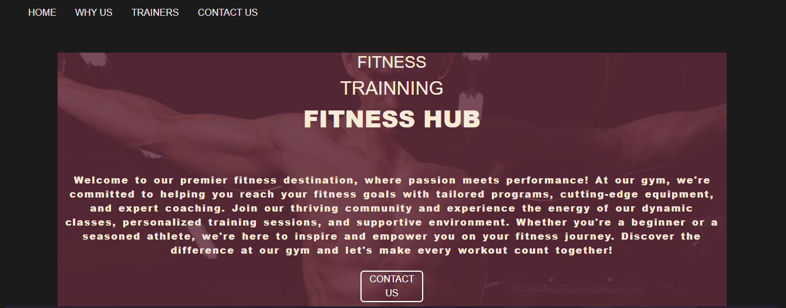
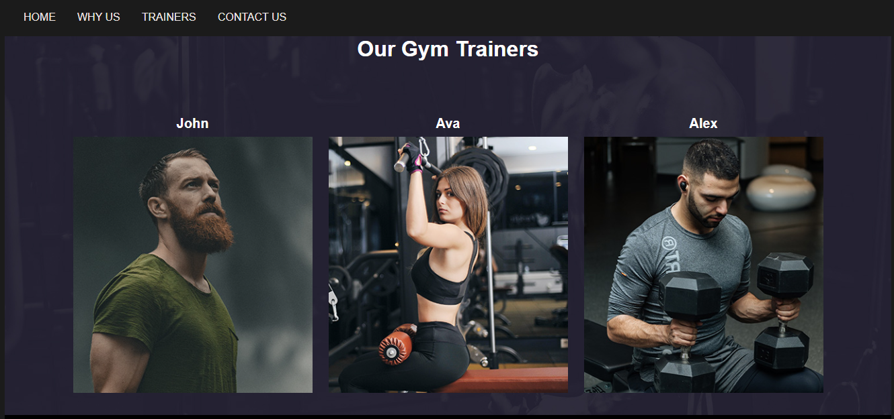

# 🏋️‍♂️ **Fitness Hub Website** 💪

A responsive gym website built with **HTML**, **CSS**, **JavaScript**, and **Bootstrap**. This project features dynamic navigation, class schedules, trainer profiles, a contact form with server-side integration, and social media links. It showcases skills in front-end development, UI/UX design, and client-side scripting.

🔗 **Live Demo**: [Fitness Hub Website](https://adarsh8086.github.io/gym/)

---

## 🚀 **Features**

- **Responsive Design**: Optimized for mobile, tablet, and desktop devices.
- **Dynamic Navigation**: Smooth and interactive navigation.
- **Class Schedules**: View the gym's available classes and timings.
- **Trainer Profiles**: Meet the trainers and learn about their expertise.
- **Contact Form**: Integrated with server-side functionality for inquiries.
- **Social Media Integration**: Connect via social media links.

---

## 🛠️ **Technologies Used**

- **HTML5**: Structure and layout of the website.
- **CSS3**: Styling and responsive design.
- **JavaScript (ES6)**: Interactive elements and dynamic content.
- **Bootstrap**: For responsive design and UI components.

---

## 🖼️ **Screenshots**

### 🏠 **Homepage**

### 🏋️‍♂️ **Trainers Page**

